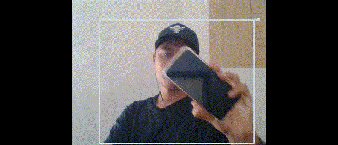

<h1 align="center">Hey 👋, Soy Jonas Lara</h1>
<h3 align="center">Un apasionado estudiante de IA y Matemáticas</h3>

- 🔭 Actualmente desarrollo los repositorios [IPN-CS](https://github.com/Jonas-Lara/IPN-CS), [UPIIT-AR](https://github.com/Jonas-Lara/UPIIT-AR) y [CIC-IPN](https://github.com/Jonas-Lara/CIC-CNN), para promover el computo que se trabaja en el Instituto Politécnico Nacional. 
- 🌱 Actualmente estoy aprendiendo **[C++](https://github.com/Jonas-Lara/Victory-cpp), OpenCV, PyTorch, LibTorch, [Computer Vision](https://github.com/Jonas-Lara/Computer-Vision), [AI](https://github.com/Jonas-Lara/AI-cpp), [Maths](https://github.com/Jonas-Lara/Piton) y Unity AR**

- 📝 Regularmente escribo artículos sobre lo que aprendo de IA en [medium](https://medium.com/@jonas_lara)

- 🐧 Todos mis repositorios trabajan sobre linux, especificamente en una distro basada en Debian, usa los scripts para configurar tu entorno

- ❤️ Soy un fan de la plataforma de desarrollo .NET, con gusto te asisto si necesitas ayuda en F# y C#

