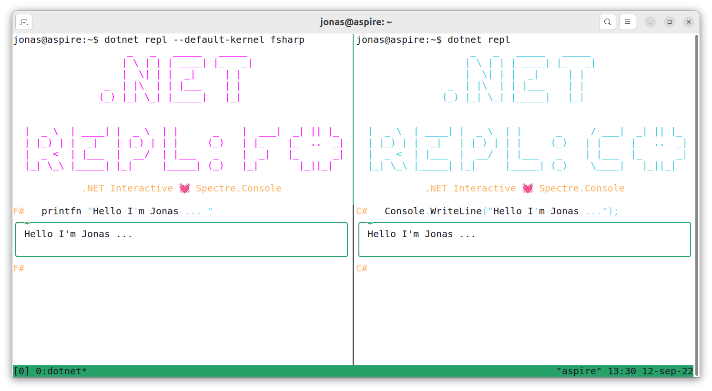

<h1 align="center">Hey ✌, I'm Jonas Lara</h1>
<h3 align="center">A passionate student of AI and Mathematics</h3>

- 🔭 I'm currently developing the repositories [IPN-CS](https://github.com/Jonas-Lara/IPN-CS), [UPIIT-AR](https://github.com/Jonas-Lara/UPIIT-AR) y [CIC-IPN](https://github.com/Jonas-Lara/CIC-CNN),to promote the computation that works at the National Polytechnic Institute 
- 🌱 I'm currently learning **[C++](https://github.com/Jonas-Lara/Victory-cpp), OpenCV, PyTorch, LibTorch, [Computer Vision](https://github.com/Jonas-Lara/Computer-Vision), [AI](https://github.com/Jonas-Lara/AI-cpp), [Maths](https://github.com/Jonas-Lara/Sigma) and Unity AR**

- 📝 I regularly write articles about what I learn from AI on [medium](https://medium.com/@jonas_lara)

- 🐧 All my repositories work on linux, specifically on a Debian based distro, use the scripts to configure your environment

- ❤️ I am a fan of the .NET development platform, I am happy to help you if you need help with F# and C#

